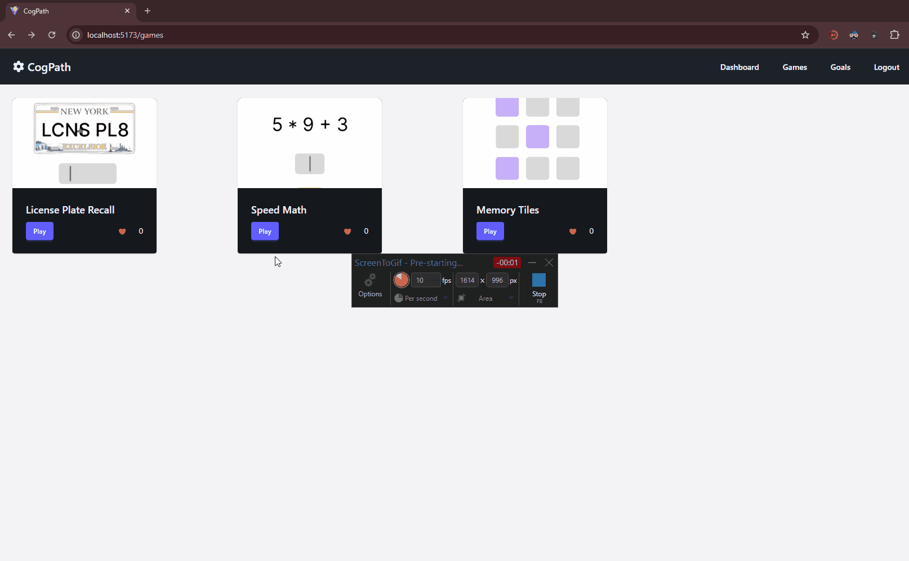

# 🧠 CogPath (Cognitive Game Dashboard)

CodePath WEB103 Final Project

Designed and developed by: Krish A. Patel, Tasmia Chowdhury, and Ryan Lov

🔗 [Cogpath](https://cogpath-frontend.onrender.com/)

---

## 📘 About

### **Description and Purpose**

The **Cognitive Game Dashboard** is a web app that helps users sharpen their mental agility through fun, bite-sized cognitive games.  
Players can test and improve their memory, attention, and problem-solving skills while tracking progress through charts and performance insights.

The app gamifies brain training — turning cognitive growth into a daily habit.  
Users can monitor their scores, streaks, and performance trends over time using a clean, data-driven dashboard.

---

## 💡 Inspiration

We wanted to create something that encourages self-improvement in a fun, interactive way — similar to how fitness apps track physical progress, but for the **mind**.  
By combining psychology-inspired mini games with visual analytics, our goal is to make mental training feel rewarding and measurable.

---

## 🛠️ Tech Stack

| Layer        | Technology                     |
| ------------ | ------------------------------ |
| **Frontend** | React + Chart.js (or Recharts) |
| **Backend**  | Express (Node.js)              |
| **Database** | PostgreSQL                     |
| **Auth**     | Supabase/ GithubOAuth          |
| **Hosting**  | Render or Vercel               |

---

## 🚀 Features

### CRUD Functionality via Goalsetting

| Action     | Description                                              |
| ---------- | -------------------------------------------------------- |
| ✅ **Create** | Create their own goals (e.g. get a 90% on License Plate Recall).    |
| ✅ **Read**   | View all your goals.                                                |
| ✅ **Update** | Edit the numeric stat on your goals.                                |
| ✅ **Delete** | Delete goals.                                                       |

Demo of CRUD operations via goalsetting:
[CRUD Goalsetting](./assets/CRUD_Goals_Demo_Web103_CapstoneProject.gif)
---

## 🎮 Game List

| Game                             | Description                                          | Skills Tested      |
| --------------------------       | ---------------------------------------------------- | ------------------ |
| ✅ **Memory Grid**              | Flip and match pairs.                                | Short-term memory  |
| ✅ **License Plate Recall**      | Show a random plate for 3 seconds, user retypes it.  | Visual recall      |
| ✅ **Speed Math**                | Timed +, −, ×, ÷ problems.                           | Speed & accuracy   |

Demo of Memory Grid:


Demo of License Plate Recall:


Demo of Speed Math:


---

## 📊 Dashboard Insights

- **Line Graphs:**

  - X-axis → Date / Game session
  - Y-axis → Score
  - Shows progress over time.

- **Bar / Pie Charts:**

  - Game distribution by type or category.
  - Average accuracy and completion time.

- **Streak Tracker:**

  - Tracks consecutive play days.
  - Unlock streak badges (🔥 7-day streak, 💪 30-day streak).

- **Performance Index:**
  - Composite metric combining accuracy × speed × consistency.

---
## IMPORTANT NOTE- UNIT 7: 
 - **GROUP REFLECTION** - in Milestones Folder
 ```bash 
      cd milestones 
```
 - **WireFrames / ERD Diagram** - in Planning  Folder 
 ```bash 
      cd planning  
```
**SlideDeck Pitch**
[SlideDeck](https://docs.google.com/presentation/d/11BlSJisZOn-BW06ZDgSuXEPI3JMgUl6OeJ7PxeARAbM/edit?usp=sharing)


## 🌟 Future Enhancements

- 🏆 **Leaderboards** – Compete globally or with friends.
- ⚔️ **Challenge Mode** – 1v1 live cognitive matches.
- 🧩 **Cognitive Categories** – Filter games by skill type (Memory, Focus, Math).
- 📈 **Export Data** – Download personal performance reports (PDF/CSV).
- 🔔 **Streak Reminders** – Optional daily reminders for consistent play.

---
