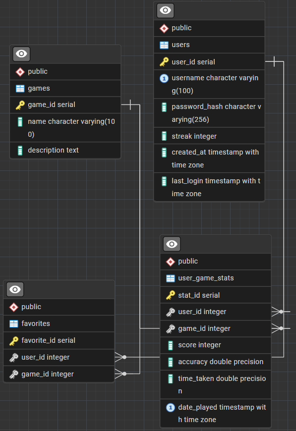

# Entity Relationship Diagram (ERD)



## 🧩 Database Schema

### `users` Table

| Column        | Type            | Description                 |
| ------------- | --------        | -----------------------     |
| user_id       | INT (PK)        | Unique user identifier      |
| username      | VARCHAR         | Login name                  |
| password_hash | VARCHAR         | Hashed password             |
| streak        | INT             | Consecutive active days     |
| created_at    | TIMESTAMPTZ     | Datetime of registration    |
| last_login    | TIMESTAMPTZ     | Last login datetime         |

```sql
CREATE TABLE users (
    user_id SERIAL PRIMARY KEY,
    username VARCHAR(100) UNIQUE NOT NULL,
    password_hash VARCHAR(256) NOT NULL,
    streak INT NOT NULL,
    created_at TIMESTAMPTZ NOT NULL,
    last_login TIMESTAMPTZ NOT NULL
);
```

---

### `games` Table

| Column      | Type     | Description            |
| ----------- | -------- | ---------------------- |
| game_id     | INT (PK) | Unique game identifier |
| name        | VARCHAR  | e.g., "Memory Tiles"   |
| description | TEXT     | Game description       |

```sql
CREATE TABLE games (
    game_id SERIAL PRIMARY KEY,
    name VARCHAR(100) NOT NULL,
    description TEXT NOT NULL
);
```

---

### `user_game_stats` Table

| Column           | Type                            | Description                   |
| ---------------- | ------------------------        | -------------------------     |
| stat_id          | INT (PK)                        | Unique stat record            |
| user_id          | INT (FK → users.user_id)        | Who played                    |
| game_id          | INT (FK → games.game_id)        | Which game                    |
| score            | INT                             | Game score                    |
| accuracy         | FLOAT                           | Correct answer percentage     |
| time_taken       | FLOAT                           | Completion time               |
| date_played      | TIMESTAMPTZ                     | Datetime of play              |

```sql
CREATE TABLE user_game_stats (
	stat_id SERIAL PRIMARY KEY,
	user_id INT NOT NULL,
	game_id INT NOT NULL,
	score INT NOT NULL,
	accuracy FLOAT NOT NULL,
	time_taken FLOAT NOT NULL,
	date_played TIMESTAMPTZ NOT NULL,
	FOREIGN KEY (user_id) REFERENCES users(user_id),
	FOREIGN KEY (game_id) REFERENCES games(game_id),
	UNIQUE (user_id, game_id, date_played)
);
```

---

### `favorites` Table

| Column       | Type                     | Description            |
| -------      | ------------------------ | ---------------------- |
| favorite_id  | INT (PK)                 | Unique favorite record |
| user_id      | INT (FK → users.user_id) | Linked user            |
| game_id      | INT (FK → games.game_id) | Linked game            |

```sql
CREATE TABLE favorites (
	favorite_id SERIAL PRIMARY KEY,
	user_id INT NOT NULL,
	game_id INT NOT NULL,
	FOREIGN KEY (user_id) REFERENCES users(user_id),
	FOREIGN KEY (game_id) REFERENCES games(game_id),
	UNIQUE (user_id, game_id)
);
```