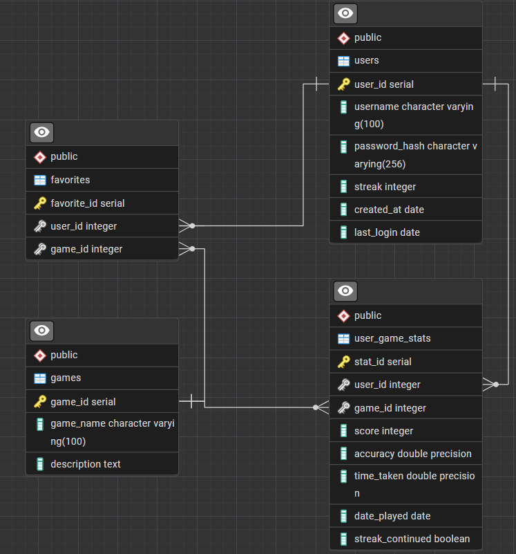

# Entity Relationship Diagram (ERD)



## 🧩 Database Schema

### `users` Table

| Column        | Type     | Description             |
| ------------- | -------- | ----------------------- |
| user_id       | INT (PK) | Unique user identifier  |
| username      | VARCHAR  | Login name              |
| password_hash | VARCHAR  | Hashed password         |
| streak        | INT      | Consecutive active days |
| created_at    | DATE     | Date of registration    |
| last_login    | DATE     | Last login time         |

```sql
CREATE TABLE users (
    user_id SERIAL PRIMARY KEY,
    username VARCHAR(100) NOT NULL,
    password_hash VARCHAR(256) NOT NULL,
    streak INT NOT NULL,
    created_at DATE NOT NULL,
    last_login DATE NOT NULL
);
```

---

### `games` Table

| Column      | Type     | Description            |
| ----------- | -------- | ---------------------- |
| game_id     | INT (PK) | Unique game identifier |
| game_name   | VARCHAR  | e.g., "Memory Tiles"   |
| description | TEXT     | Game description       |

```sql
CREATE TABLE games (
    game_id SERIAL PRIMARY KEY,
    game_name VARCHAR(100) NOT NULL,
    description TEXT NOT NULL
);
```

---

### `user_game_stats` Table

| Column           | Type                     | Description               |
| ---------------- | ------------------------ | ------------------------- |
| stat_id          | INT (PK)                 | Unique stat record        |
| user_id          | INT (FK → users.user_id) | Who played                |
| game_id          | INT (FK → games.game_id) | Which game                |
| score            | INT                      | Game score                |
| accuracy         | FLOAT                    | Correct answer percentage |
| time_taken       | FLOAT                    | Completion time           |
| date_played      | DATE                     | Date of play              |
| streak_continued | BOOLEAN                  | Used for streak logic     |

```sql
CREATE TABLE user_game_stats (
	stat_id SERIAL PRIMARY KEY,
	user_id INT NOT NULL,
	game_id INT NOT NULL,
	score INT NOT NULL,
	accuracy FLOAT NOT NULL,
	time_taken FLOAT NOT NULL,
	date_played DATE NOT NULL,
	streak_continued BOOLEAN NOT NULL,
	FOREIGN KEY (user_id) REFERENCES users(user_id),
	FOREIGN KEY (game_id) REFERENCES games(game_id),
	CONSTRAINT uq_user_game_stats UNIQUE (user_id, game_id)
);
```

---

### `favorites` Table

| Column       | Type                     | Description            |
| -------      | ------------------------ | ---------------------- |
| favorite_id  | INT (PK)                 | Unique favorite record |
| user_id      | INT (FK → users.user_id) | Linked user            |
| game_id      | INT (FK → games.game_id) | Linked game            |

```sql
CREATE TABLE favorites (
	favorite_id SERIAL PRIMARY KEY,
	user_id INT NOT NULL,
	game_id INT NOT NULL,
	FOREIGN KEY (user_id) REFERENCES users(user_id),
	FOREIGN KEY (game_id) REFERENCES games(game_id),
	CONSTRAINT uq_favorites UNIQUE (user_id, game_id)
);
```